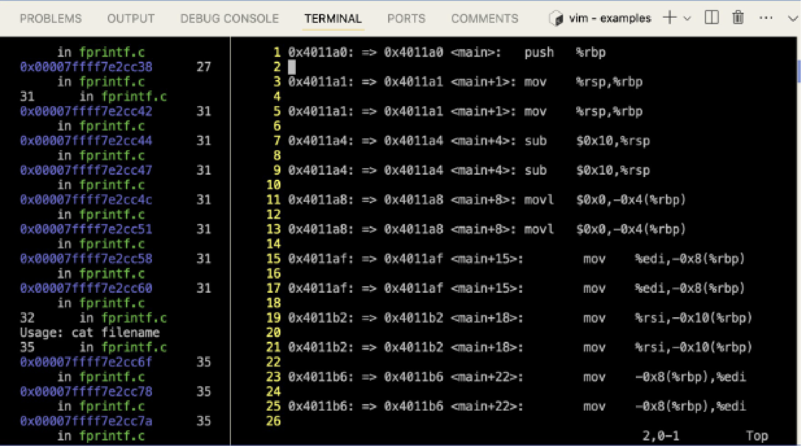
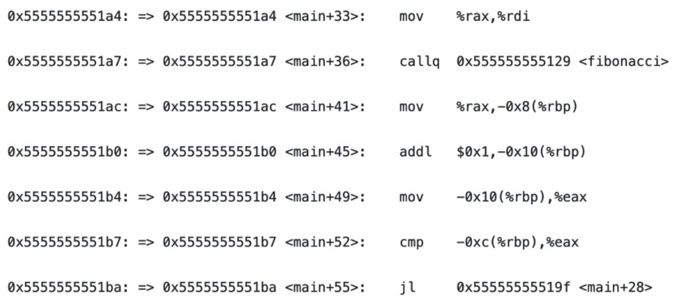
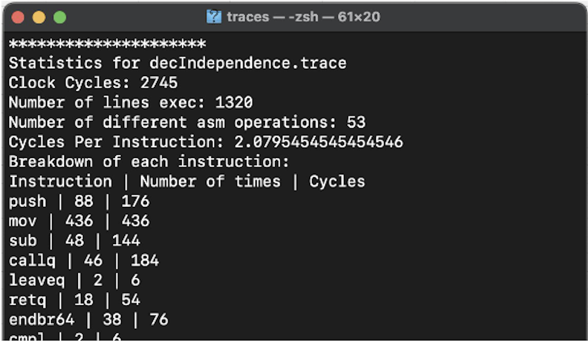
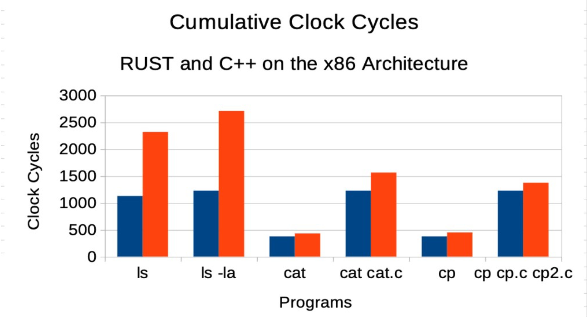
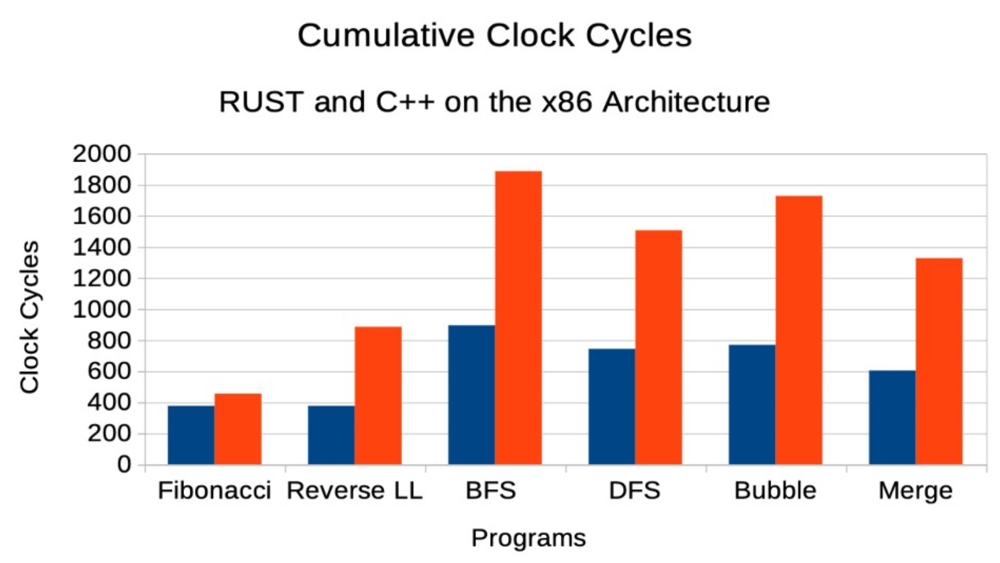
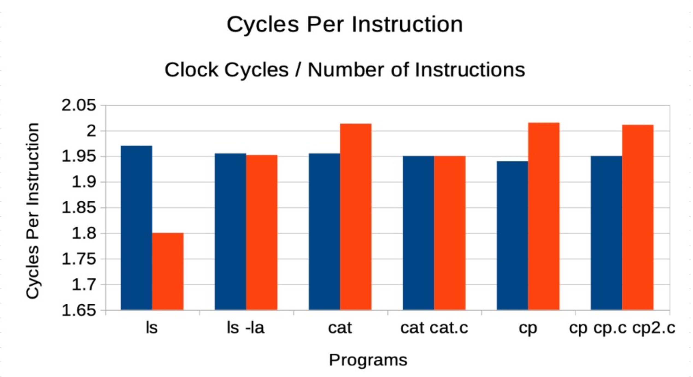
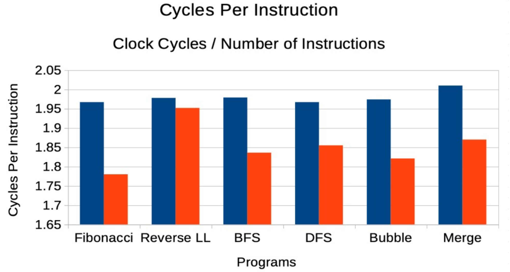
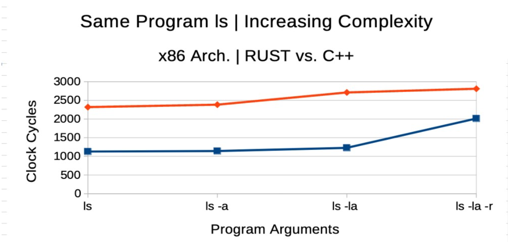
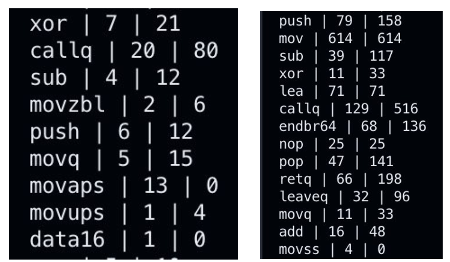

# Thesis

The following is an overview of the Honors Thesis that tra86 was created as a part of. It only includes the parts of the thesis that the software stack concerns itself with. The full document contains additional information on alternate approaches, pitfalls, and the reasonings behind honing down to the specific approach described herein. The full document is also linked in the website, and is published in the UMass Amherst Libraries.

This is **not** the complete thesis which discusses every single aspect, approach, and finding. This is a concise version, which is edited and presented to communicate the usage and purpose for the tra86 toolchain.

The full version also discusses the reasoning behind why RUST exists, how RUST is better than C++ in other aspects, and why this work matters. I would highly encourage and be obliged if you can read the same.

Thank you for checking my work out.

## Update

A Better version of tra86 is almost ready for deployment, with JIT compatibility, ARM architecture compatibility, and interfacing with LLDB. More information will be published here soon. This work is the earlier version of tra86, which is based on the x86 architecture and interfaces with GNU/GDB.

## Complete Texts

The complete version of the thesis is currently published in the corpus of Honors Thesis at the UMass W.E.B. Du Boid Library.

Alternatively, a version of the same can be accessed [here](https://github.com/cics-syslab/RUST-tracing-tool/blob/main/manuscript/docx/Comparing%20RUST%20and%20C%2B%2B%20Performance%20Metrics%20-%20Kush%20S.pdf).

# Comparing RUST and C++ Performance Metrics: An Overview

**Kushagra Srivastava, Prof. Meng-Chieh Chiu**
**Manning College of Information & Computer Sciences, UMass Amherst**
**iCons Program**

## Introduction

- **Overview**: This Honors Thesis attempts to compare between two low-level programming languages: RUST and C+. These are both languages that were made during different eras, yet are widely utilized in low-level systems programming.

- **RUST and C++**: These are two of the most widely-used systems programming languages today. **C++** has been a staple for several decades, being integral to many low-level systems like operating systems, embedded systems, and performance-critical applications. On the other hand, **RUST** is a more recent language that has rapidly gained popularity due to its focus on safety, especially around memory management and concurrency.

- **Systems Specialization**: The focus of this research lies in **low-level computing**, which involves topics such as **Operating Systems**, **Programming Languages**, and **Compilers**. These are crucial for developing performance-critical systems where low overhead and precise resource management are key.

- **History of C++**: Introduced in the 1970s, **C++** has seen constant evolution, including support for object-oriented programming, template metaprogramming, and low-level memory manipulation. However, its design has also led to notorious issues around **security**, primarily due to manual memory management and lack of built-in safety features.

- **The Rise of RUST**: **RUST** was released in **2013** by Mozilla Research, and it was designed to address common problems in C++ by providing modern solutions to **memory safety** and **thread safety**, without sacrificing performance. The key feature of RUST is its **borrow checker**, which ensures memory access without the need for a garbage collector. RUST prioritizes Code Safety, Security, and Optimization. On the other hand, C++ gives the user complete freedom and control over their code, even if it comes at a risk of breaking the system.

- **Performance and Debugging Comparison**: With **fewer runtime errors**, **better debugging tools**, and a focus on **memory safety**, RUST is expected to reduce many of the issues that typically plague C++ programs, such as segmentation faults or dangling pointers. This research aims to determine if these advantages also lead to better **performance metrics** when comparing the two languages.

- **Research Objective**: The main objective of this research is to assess whether RUST can outperform C++ in systems-level programming tasks, particularly in terms of resource usage like **clock cycles**, **memory consumption**, and overall **execution speed**. The underlying hypothesis is that newer programming paradigms introduced by RUST should lead to **better performance** and fewer critical errors in practical applications.

- The motivation to compare the two programming languages lies in my interest to understand if RUST, being a newer low-level programming language, is an overall better option to use compared to C++ when it comes to low-level systems programming. The decades of contributions that have gone into C++ since release has made it the primary systems programming language. Thus, if an undertaking should be made to shift most of the code from C++ to RUST, the results of this thesis would give developers an adequate, hardware-agnostic idea of the performance benefits that RUST provides for their specific use case.

## Methods

This study uses the **Intel x86 architecture** to perform a side-by-side comparison of **RUST** and **C++** performance. The research methodology revolves around two key approaches: **Tracing** and **Analyzing**.

### Tracing:

- **Trace Runtime of Programs**: The study involves running identical programs written in **RUST** and **C++** and tracking their behavior at the lowest level. In our case, this lowest level is Assembly. Taking the x86 CPU architecture and instruction set as a baseline, the same program is written on both languages and the execution is traced by recording the machine instructions executed. The **trace** refers to recording the **execution of instructions in the Assembly during the runtime** of each program, capturing every operation that the CPU performs.

- **Decompile to Assembly**: All **high-level code** from both RUST and C++ is decompiled into **x86 assembly** code, which is the machine-level language that the CPU understands. This ensures that we are evaluating the actual instructions the processor is executing, regardless of how high-level syntax differs between the two languages.

- **Track Multiple Program Runs**: To ensure accurate and representative data, multiple program runs are traced for each language. This is necessary due to factors such as cache usage and different optimization paths taken by the compiler.

- Example: For the same program on the two languages, ensuring that the logic and complexity is uniform, if we were to trace the Assembly instructions executed by the CPU during the run time, and:

RUST was able to execute this program with 17 instructions, 25 total clock cycles

C++ was able to execute this program with 19 instructions, 32 total clock cycles.

Then RUST was more efficient than C++ in executing the same program, with the same logic, using lesser CPU resources.

### Analyzing:

- **Mapping Instructions to CPU Clock Cycles**: Each assembly instruction is mapped to the **number of CPU clock cycles** it consumes. The goal is to determine how efficiently each language uses the CPU to execute identical tasks, as more clock cycles typically indicate inefficiency.

- The data on the number of CPU Clock Cycles required per instruction was taken from the Intel IA32 and IA64 Reference Manuals, as well as Agner Fog's Instruction Tables (which consisted of a set of experiments to deduce the clock cycles for various x86 Intel Processors).

- **Comparing Code Logic**: By analyzing the **assembly instructions**, we can get a clear understanding of how the **code logic** differs between RUST and C++. This includes operations such as **loops**, **function calls**, and **memory access patterns**. A persistent effort was taken to keep the logic and behavior of the code for a given program equal across the two programming languages. This gives us the best comparisons of which programming language's compiler better optimizes code to run on the processors.

- **Identifying Performance Bottlenecks**: Special focus is placed on pinpointing areas where **C++** may cause performance issues, such as **memory allocation**, **pointer dereferencing**, and **cache misses**, while evaluating if RUST's **ownership model** and strict memory management rules result in fewer bottlenecks. Various try-catch errors, and frameworks to maintain a cohesive log in the case of a **Segmentation Fault** or **Memory Leak** were put in place, such that we could still retain this information for analyzing.

## Programs

The programs used for the comparison consist of various **benchmarking tasks** designed to evaluate key performance characteristics, such as **instruction throughput**, **memory usage**, and **execution time**. These tasks range from simple computational operations to more complex algorithms with higher memory and CPU demands.

More information for each software is provided under this website.

### X86 Assembly Tracer



- **Purpose**: The **x86 Assembly Tracer** is a tool specifically designed for this study to capture **every instruction** executed by the CPU during program runtime. This provides granular visibility into the low-level operations performed by RUST and C++ programs.

- The tool uses a debugging approach to tracing. The program has to be compiled manually, and stop at the assembly level. At the Assembly level, debugging flags are passed to get a linker object. After which, header files are linked, and an executable is produced. While in a regular run, all of this is handled by the compiler itself: we need to do this process manually to ensure that debugging files are passed to the Assembly file generated, and not to the source code.

- These instructions vary slightly for RUST and C++. I suggest to use the ```clang``` compilers as a baseline, since that ensures a LLVM backend. Once an assembly file is generated by ```rustc```, it is recommended to invoke Clang for the linking process. RUST includes a bunch more header files, which have to also be manually 1) looked into the system, and 2) linked using clang.

- The x86 Tracer latches onto GNU/GDB using the Python API, and steps into each assembly instruction. As it does that (and the program is executed), it logs each instruction executed, along with metadata pertaining to each. The whole process is automated. The user only needs to:

1. Start GDB
2. Stage the program on GDB
3. Stage the Python script that steps into + records asm instructions from GDB as GDB goes through and executes the program (automated).
4. Run the program.

- **Captured Metadata**: The tracer logs a variety of metadata for each instruction, such as:
  - **Instruction Type**: The exact operation being performed (e.g., `add`, `mul`, `mov`, `jmp`).
  - **Memory Locations**: Information about the memory addresses being read from or written to.
  - **Memory Amounts**: The size of the data being manipulated (e.g., 4 bytes, 64 bits).
  - **Line Number**: The corresponding line in the high-level code that triggered the assembly instruction.
  - **Jump Triggers**: Conditional jumps, function calls, and loops.
  - **Extenuating Factors**: Edge cases like **SegFault Errors** or **Core Dumps** where the program crashes.

An example output looks like such:



(A usual trace can be hundreds of thousands of lines of this data).

### Analyzer



- **Input & Processing**: The **Analyzer** takes in the trace file generated by the X86 Assembly Tracer and analyzes it to compute various performance metrics. These include:
  - **Cumulative Clock Cycles**: The total number of clock cycles consumed by the program.
  - **Cycles Per Instruction (CPI)**: The average number of cycles taken to execute a single instruction.
  - **Operator Analysis**: Breakdowns of performance based on specific **operators** (e.g., arithmetic, bitwise, memory access).

- **Performance Metrics**: The Analyzer outputs detailed metrics for:
  - **Each Operation**: Every assembly operation is analyzed for performance.
  - **Each Operand**: Memory access patterns, argument passing, and their effects on the CPU are scrutinized.
  - **Error Handling**: Scenarios like **SegFaults** or **Core Dumps** are also included, as these can have a significant impact on overall performance.

- The stats will be provided for any valid Assembly trace file generated from the above script.

## Results

The key performance results are presented below in two primary forms:

### Cumulative Clock Cycles

For the analysis of RUST and C++, I ran the tracer
analyzer toolchain (herein referred to as tra86), on the same program across RUST and C++, with minor tweaks for each runtime. The programs run can be divided into two main
segments:

  * Linux System Programs and Commands
  * Self-written Programs to test constraints.

- **RUST vs C++ Clock Cycles**: The number of clock cycles used by the CPU to execute programs in RUST versus C++ is displayed across a variety of tasks.
  - 
  - 
    This graph shows the total number of cycles consumed by the CPU for each program written in RUST and C++. Fewer clock cycles mean better efficiency.

- **Insights**:
  - **RUST uses fewer clock cycles** than C++ across most of the benchmark tasks.
  - The difference becomes especially noticeable in more **complex programs** where C++ struggles with increased resource consumption.

### Cycles Per Instruction (CPI)

- **Cycles Per Instruction**: This metric provides insight into the **efficiency** of each instruction executed by the CPU.
  - 
  - 
    This graph compares the average number of cycles per instruction for both languages across identical programs.

- **Insights**:
  - **RUST outperforms C++** by consistently using fewer cycles per instruction, which may be attributed to its optimized memory management and avoidance of undefined behavior.
  - Programs written in **C++** tend to suffer from higher **cache misses** and **memory management overhead**, leading to a greater number of cycles per instruction.

### Increasing Complexity in Programs

- **Complexity vs. Performance**: The performance of both RUST and C++ is analyzed as program complexity increases.
  - 
    This graph tracks how each language handles the same program logic as its complexity scales.

- **Insights**:
  - As **program complexity rises**, RUST scales more efficiently compared to C++. The **ownership model** in RUST ensures that memory is managed dynamically, resulting in fewer **resource leaks** or **overhead**.
  - I speculate that one of the results for this effect is the fact that RUST uses more obscure x86 instructions than C++ for compilation, which result in more clock cycles used per
  instruction. The Instruction Tables I am using [3] contain many variations of the same instructions with different operands, as well as contain complex instructions that are
  combinations of multiple simple instructions (such as mov and movq2d2), which may use higher number of clock cycles per instruction.
  - 
  Example snippets of RUST (left) and C++ (right)
  analyzer outputs. RUST uses more complex forms of the “mov” instruction, thus maybe resulting in more Cycles Per Instruction.

## Conclusion & Further Scope

- **RUST Outperforms C++**: Across all tested scenarios, **RUST either matches or exceeds the performance of C++**. This is most evident in terms of **clock cycle efficiency**, where RUST uses fewer resources to complete the same tasks.

- **Enhanced Security and Debugging**: RUST’s **memory safety** and **ownership model** significantly reduce the number of runtime errors, making it a safer and more reliable language for **systems programming**.

- **Potential for Migration**: The study concludes that migrating legacy systems to RUST could lead to **higher compute power** with fewer resources, reducing **electricity consumption** and **long-term costs**.

- **Future Work**: Further research will focus on optimizing **RUST’s debugging features**, as well as exploring its applications in larger-scale systems with even more complex performance requirements.
